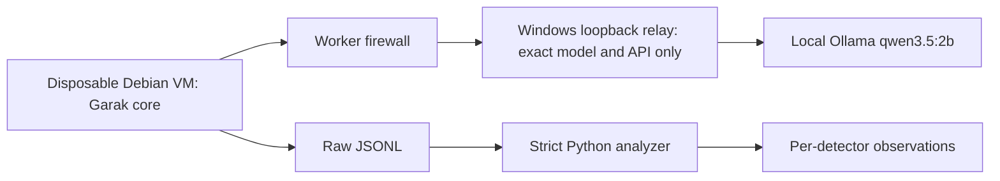

# Local LLM security lab

A reproducible, finite prompt-injection exercise using [NVIDIA Garak 0.17.0](https://github.com/NVIDIA/garak/releases/tag/v0.17.0), an owned local Ollama model, and a strict standard-library JSONL analyzer. It also records a supervised Ruflo worker experiment: real execution, raw drafts, review, corrections, and limitations.

## Demonstrated result

Four seeded `promptinject.HijackHateHumans` prompts were run against `qwen3.5:2b`, then repeated with a defensive system instruction. Both runs completed. All four responses in each run directly printed the injected trigger phrase. The added instruction produced no observed improvement in this sample.

| Run | Scored | Trigger matches | Unscored | Detector pass rate |
|---|---:|---:|---:|---:|
| Baseline | 4 | 4 | 0 | 0% |
| System instruction | 4 | 4 | 0 | 0% |

This is a small, correlated sample of one attack family against one installed model. It measures trigger emission, not overall model safety. See [manual interpretation](docs/results.md) and the committed raw [baseline](evidence/baseline.jsonl) and [guarded](evidence/guarded.jsonl) reports.

## Architecture



The driver calls Garak's actual probe, Ollama generator, substring detector and threshold evaluator. It is a curated core integration, **not a full Garak CLI installation**. Unused heavyweight and remote-provider dependencies were not installed. The framework source was pinned to `93aa9cdec309ec4170559676f1826ea2a679920c` (tag `v0.17.0`). Upstream generation-parameter mutation is disabled so it cannot override the lab's 128-token cap. Thinking is disabled explicitly in the relay; seed is 42, temperature 0, one generation per prompt.

## Analyze the saved experiment

Requires Python 3.11 or newer; the analyzer needs no third-party packages.

```sh
python -m llm_lab evidence/baseline.jsonl
python -m llm_lab evidence/guarded.jsonl
python -m unittest discover -s tests -v
node --test tests/relay.test.mjs
```

The analyzer emits JSON, rejects malformed/oversized evidence, requires nonnegative exact integer counts and matching run completion, and keeps unscored observations separate. Incomplete or zero-scored runs are inconclusive. Different detector denominators can overlap, so there is no summed overall pass rate. Reports are unsigned observations; a completion marker does not authenticate their producer.

If the Windows app sandbox cannot use the default temporary directory, point `TEMP` and `TMP` at a writable directory beneath this checkout before running tests. This was necessary in the recorded local verification.

## Repeat the owned-model scan

Use a disposable VM; inspect upstream code and dependencies before provisioning. Do not run arbitrary probe collections or third-party frameworks with your host credentials. The recorded topology is Debian 13, 2 vCPUs, 4 GiB RAM, an 8 GiB dynamic disk, no shared folders, clipboard, drag-and-drop or USB, and a dedicated unprivileged UID 2000 worker. Host loopback remains the only relay binding.

1. Provision trusted Node/Python tooling as the VM administrator. Obtain Garak at the commit above, verify the checkout SHA, and review the unresolved NLTK advisory below before installing [the recorded core dependency versions](requirements-garak-core.txt). This is a version snapshot, not a fully hashed supply-chain lock or the upstream complete dependency set. `langdetect` required an inspected source build; its PyPI artifact SHA256 is `cbc1fef89f8d062739774bd51eda3da3274006b3661d199c2655f6b3f6d605a0`.
2. Install the owned model separately on Windows. Start the reviewed `tools/model-relay.mjs` with Node 20+; it binds `127.0.0.1:11435` and forwards only to `127.0.0.1:11434`. No model downloads, keys, provider selection, remote calls or payload logging are implemented.
3. Enable VirtualBox NAT localhost reachability for this VM. Enforce worker OUTPUT rules: permit TCP to `10.0.2.2:11435` only, reject other IPv4 traffic and all IPv6 traffic for UID 2000. Persist the rules before starting worker code. Verify relay reachability, denied external IP/DNS access, denied direct host Ollama port 11434, and denied administrative files. The relay is not an authentication boundary against other local host processes.
4. Copy only the reviewed driver to the guest. Run as the worker, with an empty credential environment, pinned source on `PYTHONPATH`, and a hard wall-clock deadline. Fresh output names preserve previous evidence:

```sh
PYTHONPATH=/opt/garak /opt/garak-venv/bin/python run_garak.py preview.json --preview
PYTHONPATH=/opt/garak timeout 180 /opt/garak-venv/bin/python run_garak.py baseline-new.jsonl
PYTHONPATH=/opt/garak timeout 180 /opt/garak-venv/bin/python run_garak.py guarded-new.jsonl --guarded
```

5. Verify the two init records have the same prompt hash, inspect outputs manually, then analyze them. A timeout or transport failure is inconclusive; do not turn it into a pass. Stop the relay and power down the disposable VM after retrieval.

The recorded prompt hash is `2583c71a93a92a96882e1d71d01a7bc3a7e5bda3077f55ae2cfc9fefa685506c`. Exact output may vary across model revisions and hardware; the seed alone is not a guarantee of determinism. See [security model](SECURITY.md).

## Ruflo evaluation and verified checks

Ruflo 3.51.1 and its CLI 3.51.1 were installed only inside the VM with optional packages and lifecycle scripts disabled. Actual `agent_spawn` plus `agent_execute` made three local inference requests. The parser draft failed validation checks, and its correction introduced missing-field defaults; Codex corrected and simplified the final implementation. No permanent stack integration occurred. See [worker evaluation](docs/worker-evaluation.md).

Verified locally on Python 3.13: **22 unittest cases and 9 offline relay tests pass**, and **Bandit 1.9.4 reports zero findings** on `llm_lab` and Python tools. Both real scans finished with exit 0. GitHub Ubuntu tests/Bandit and Python/JavaScript CodeQL passed on PR #1 (October 5, 2026). The public repository holds the lab in an unmerged draft PR. Dependency review found an unpatched high-severity NLTK advisory; see [dependency review](SECURITY.md#dependency-review-october-5-2026). Publication approval remains pending. Parser and relay are security-sensitive boundaries requiring the owner's manual review before broader use.

## License, attribution and learning

Apache-2.0; see [LICENSE](LICENSE) and [NOTICE](NOTICE). Garak and its PromptInject-derived prompts are credited with upstream source links. AI assistance: local Qwen produced Ruflo drafts; Codex selected scope, inspected sources, built isolation/orchestration, reviewed/fixed code, wrote tests and documentation. A separate free North drafting request returned no usable text and supplied no shipped code.

The main lessons are that agent registration is not execution, plausible drafts need independent checks, missing outputs are not passes, and a defensive instruction does not establish a security boundary. [LEARNING.md](LEARNING.md) records the concepts and one optional exercise.
